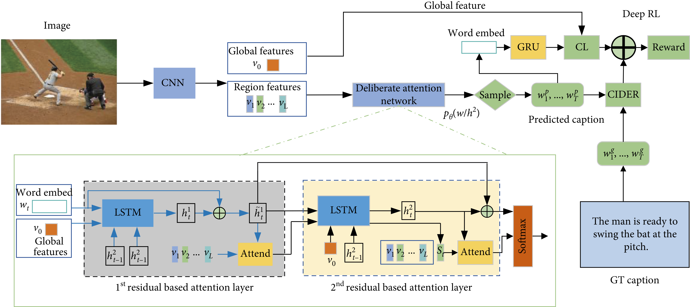
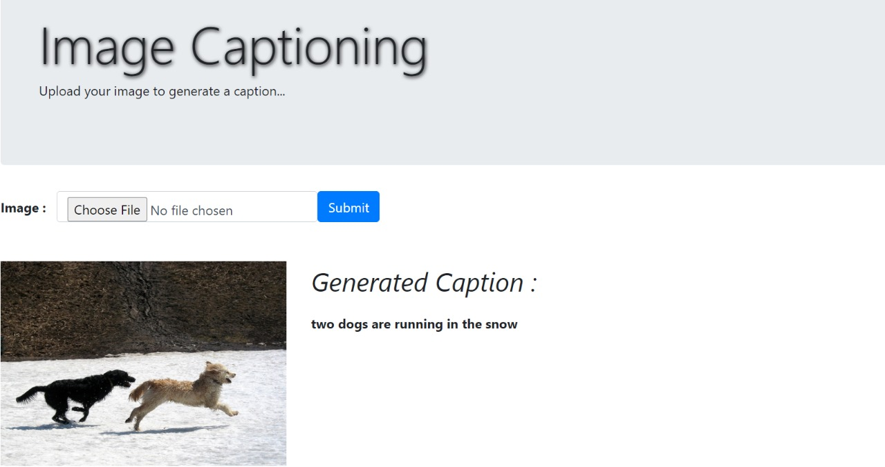

# **Title: Image Captioning**

## **1. Methodology**

## **2. Description**
Image captioning can be regarded as an end-to-end Sequence to Sequence problem, as it converts images, which is regarded as a sequence of pixels to a sequence of words. For this purpose, we need to process both the language or statements and the images. For the Language part, we use recurrent Neural Networks and for the Image part, we use Convolutional Neural Networks to obtain the feature vectors respectively.

## Dataset
The model is trained on [Flickr30k Dataset](https://illinois.edu/fb/sec/1713398) (This dataset has 30k images and each image has corresponding 5 captions) 
Although it can be trained on others like Flickr8k or MS COCO

## **3. Input / Output**

Image | Caption 
--- | --- 
 | **Generated Caption:**  A white and black dog is running through the water
 | **Generated Caption:** man is skiing on snowy hill
 | **Generated Caption:** man in red shirt is walking down the street

## References
[1] Oriol Vinyals, Alexander Toshev, Samy Bengio, Dumitru Erhan. [Show and Tell: A Neural Image Caption Generator](https://arxiv.org/pdf/1411.4555.pdf)

[2]	Kelvin Xu, Jimmy Ba, Ryan Kiros, Kyunghyun Cho, Aaron Courville, Ruslan Salakhutdinov, Richard Zemel, Yoshua Bengio. [Show, Attend and Tell: Neural Image Caption Generation with Visual Attention](https://arxiv.org/pdf/1502.03044.pdf)

## License
MIT License. See LICENSE file for details.

## **4. Live link**
Link: https://captionbott.herokuapp.com/

## **5. Screenshot of the Interface**

